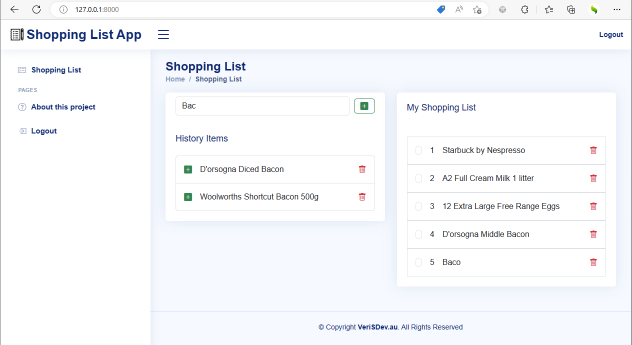
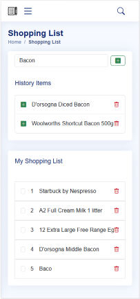
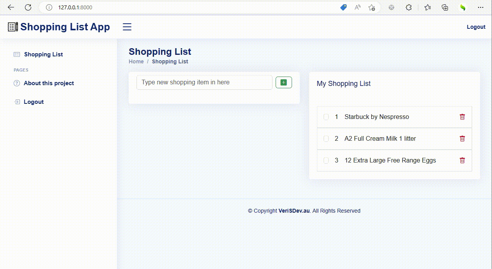

# Shopping List App

## This small Shopping List App was develop by VeriSDev.au by using the following technology stacks:
1. Python
2. Django
3. Crispy Forms
4. HTMX
5. Bootstrap 5.3

**Desktop Mode.**

**Mobile Mode**

Responsive Design with mobile view like the following screenshot. Search facility of the history shopping item automatically display using HTMX and responding interactively without required to refresh the whole page.

**Interactivve Preview**

**Docker

